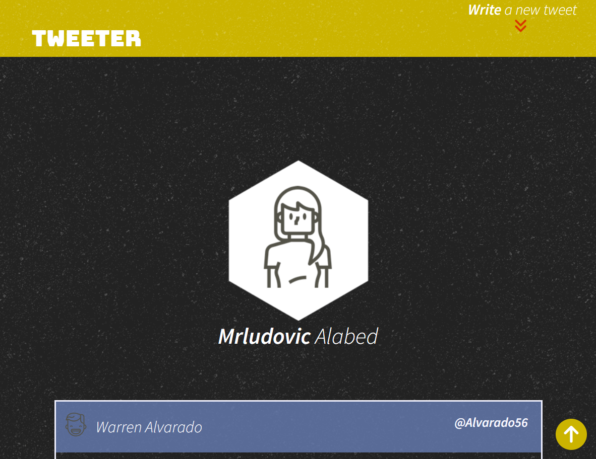
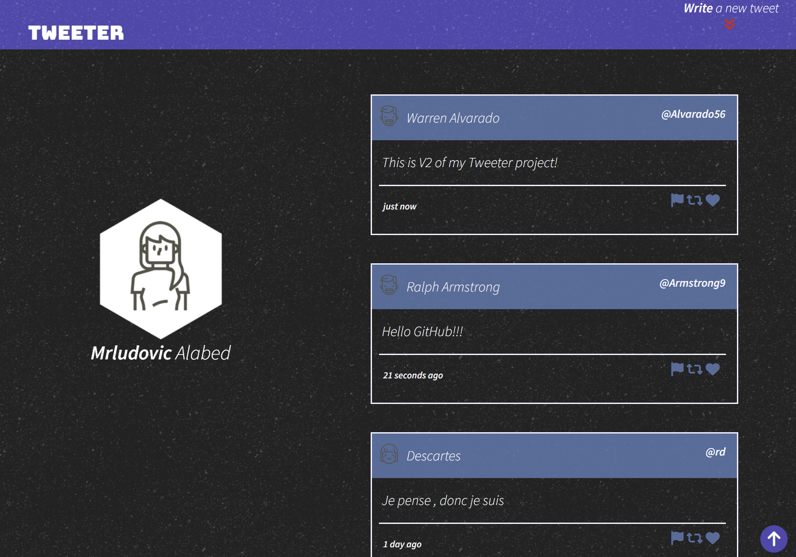

# Tweeter Project

Tweeter is a simple, single-page Twitter clone.

This repository is the starter code for the project: Students will fork and clone this repository, then build upon it to practice their HTML, CSS, JS, jQuery and AJAX front-end skills, and their Node, Express back-end skills.

## Functionalities

- clicking on the name will open a new tab directing to the GitHub repository.
- the icons has three colors, the regular then it will change when hovering over them, and will change when click on them.

## Final Product

## Getting Started

1. [Create](https://docs.github.com/en/repositories/creating-and-managing-repositories/creating-a-repository-from-a-template) a new repository using this repository as a template.
2. Clone your repository onto your local device.
3. Install dependencies using the `npm install` command.
3. Start the web server using the `npm run local` command. The app will be served at <http://localhost:8080/>.
4. Go to <http://localhost:8080/> in your browser.

## Dependencies

- Md5
- body-parser
- Chance
- Express
- Node 5.10.x or above

## Dev Dependencies

- nodemon